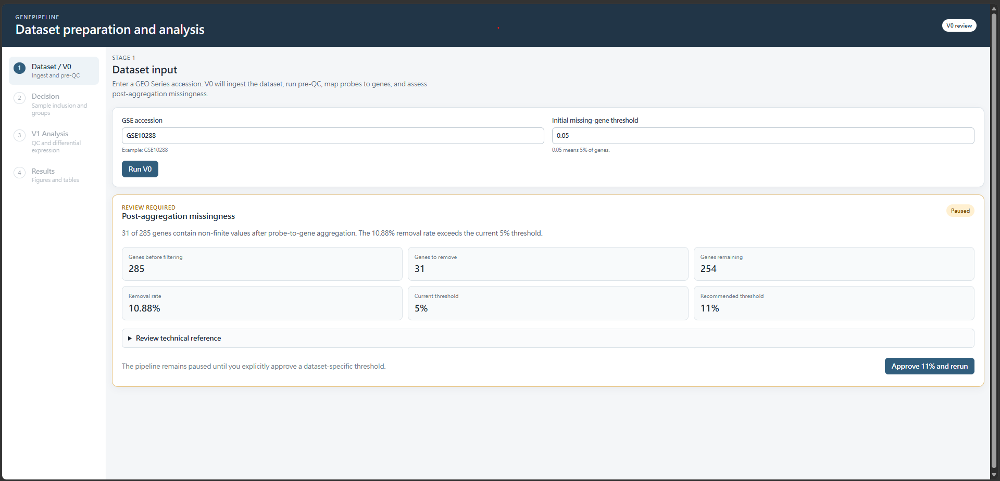
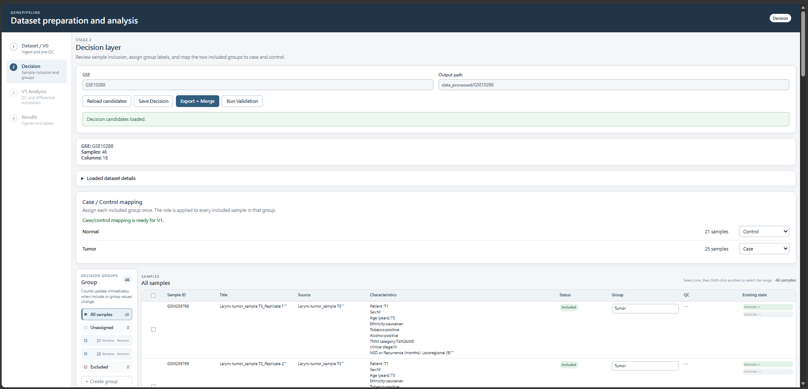
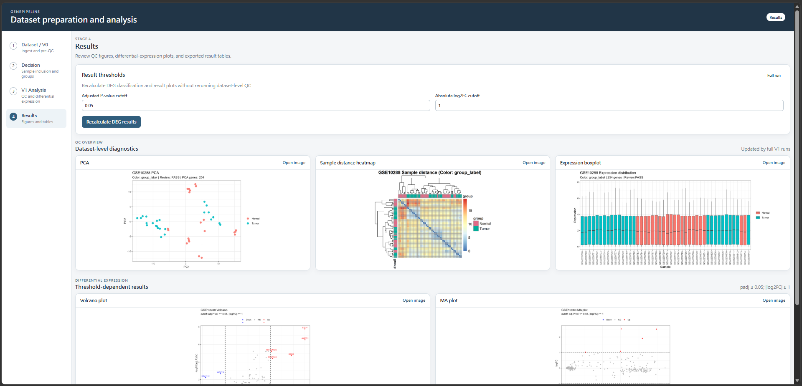

# GenePipeline V1.1.1 MVP

> **A local, browser-based GEO expression analysis workflow for manually prepared GEO Series Matrix inputs, preprocessing, sample decision management, quality control, and two-group differential-expression analysis.**
>
> 本專案是一套以 **R + Node.js + Browser UI** 建構的本機 Gene Expression Pipeline。使用者需先手動準備 GEO Series Matrix 等原始檔案，Pipeline 會讀取本機資料，完成前處理、樣本決策、QC、差異表現分析與結果檢視，並保留可追蹤的分析紀錄。

---

## 專案定位

GenePipeline 目前定位為一套 **Windows 本機單機版 MVP**，主要目標不是取代所有生物資訊分析工具，而是提供一個：

- 對生物領域使用者較友善的操作介面
- 可追蹤資料處理與人工決策的流程
- 會在分析前檢查輸入資料與設定的安全閘門
- 可從本機 GEO Series Matrix 檔案一路執行到 QC 與 DEG 結果的完整工作流

目前適合：

- 實驗室內部資料初步整理與分析
- GEO expression dataset 的重現與驗證
- 生物資訊流程教學與展示
- 作為可擴充的資料清洗與分析系統基礎

---

## Pipeline 流程

```text
手動準備 GEO Series Matrix
放入 data_raw/<GSE>/
    ↓
UI 輸入 GSE accession 作為資料夾 key
    ↓
V0：讀取本機 GEO 檔案並前處理
    ↓
Missingness Gate
    ↓
Decision Layer：樣本分類與 Case / Control 設定
    ↓
Export + Merge
    ↓
Validation
    ↓
V1：QC + Differential Expression
    ↓
Results Dashboard
```

### V0：資料匯入與前處理

V0 負責：

- 讀取 `data_raw/<GSE>/` 中的 GEO Series Matrix
- 視需要讀取 platform annotation / GPL annotation 檔案
- 整理 sample metadata
- GPL annotation 與 probe-to-gene mapping
- probe-level expression 聚合為 gene-level expression
- 檢查非有限值與 gene missingness
- 產生 canonical gene expression matrix
- 建立 missingness review gate

### Decision Layer

Decision Layer 讓使用者：

- 將 sample 分配至正式 Group
- 將不使用的 sample 設為 Excluded
- 暫時保留尚未決定的 sample 為 Unassigned
- 批次 Move、Exclude、Unassign
- 建立、重新命名與移除 Group
- 指定 Case / Control
- 儲存人工決策
- 匯出並合併分析用 metadata
- 執行 V1 前 validation

### V1：QC 與差異表現分析

V1 負責：

- sanity check
- canonical input validation
- finite-value validation
- two-group design validation
- PCA
- sample-distance heatmap
- expression boxplot
- limma differential-expression analysis
- Volcano plot
- MA plot
- DEG table、summary、manifest 與 plot points 輸出

---

## 系統需求

目前版本以 Windows 環境開發與測試。

### 必要軟體

- Windows 10 或 Windows 11
- Node.js
- R
- 下載 GEO 原始檔案時需要網路環境
- 建議使用 Chrome 或 Edge

### Node.js 套件

第一次使用時，請在專案根目錄執行：

```bat
npm install
```

### R package environment（Phase 2）

使用者只需安裝 R；GenePipeline 啟動後會自動 bootstrap renv、依照隨附的 `renv.lock` 還原套件並驗證環境。第一次設定需要網路，可能需要數分鐘。後續環境已 Ready 時不會重新安裝。

直接分析依賴的唯一清單是根目錄 [DESCRIPTION](DESCRIPTION) 的 `Imports`；環境工具列在 `Suggests`。實際版本與遞迴依賴由 [renv.lock](renv.lock) 記錄，不使用使用者的 global R library 代替缺少的 project packages。

啟動命令視窗會顯示 checking → bootstrapping／restoring → validating → ready；詳細 setup 記錄位於 `logs/environment/`。Setup 未完成或失敗時，分析會回報 package environment error，請等待完成後重試；若網路問題已排除，可重新啟動 GenePipeline 自動重試。

開發／診斷指令（一般首次使用不需手動執行）：

- `npm run preflight:r`：只檢查 R executable 與版本，不依賴 renv。
- `npm run preflight:packages`：唯讀驗證 project environment。
- `npm run setup:environment`：獨立 setup／repair；依 lockfile restore，Ready 時直接通過。
- `GET /api/environment`：查詢 package Ready 與 structured diagnostics。
- `POST /api/environment/setup`：明確重試 setup，回傳 202 後可查詢進度。

分析 request 不安裝套件、不改寫 lockfile。V0、Decision、V1 共用同一個 root environment。
詳見 [Phase 2 environment architecture 與驗證報告](docs/PACKAGE_ENVIRONMENT_PHASE2.md)。

---

## 資料輸入方式

GenePipeline V1.1.1 MVP 目前採用 **手動準備 GEO 檔案** 的方式。

在執行 V0 前，請先到 GEO 下載目標 dataset 的 Series Matrix 檔案，並放入：

```text
data_raw/<GSE>/
```

例如第一次測試可使用：

```text
GSE10288
```

建議資料夾結構：

```text
data_raw/
└─ GSE10288/
   ├─ GSE10288_series_matrix.txt
   └─ GPL6426_family.soft
```

或若下載到壓縮檔：

```text
data_raw/
└─ GSE10288/
   ├─ GSE10288_series_matrix.txt.gz
   └─ GPL6426_family.soft
```

其中：

- `GSE10288_series_matrix.txt` 或 `.txt.gz` 是主要輸入檔。
- `GPL6426_family.soft` 是 platform annotation / GPL annotation 檔案。部分 dataset 可能需要對應的 GPL annotation 才能完成 probe-to-gene mapping。
- UI 中的 `GSE accession` 目前作為資料集識別碼與資料夾定位依據。
- 目前版本 **不會自動從 GEO 下載資料**。

### 目前支援範圍

目前版本主要支援：

```text
GEO microarray
single GSE
Series Matrix-driven ingest
gene-level downstream expression output
```

目前不支援直接分析：

```text
FASTQ
BAM
CEL raw image-level files
single-cell count matrix
RNA-seq raw count matrix
```

若 GEO dataset 沒有可用的 Series Matrix，或只有 raw sequencing files，則不適合直接使用目前版本的 GenePipeline。

## 安裝方式

### 方法一：從 GitHub 下載 ZIP

1. 在 GitHub repository 頁面點選 `Code`
2. 選擇 `Download ZIP`
3. 解壓縮到本機資料夾
4. 開啟解壓縮後的專案根目錄
5. 執行：

```bat
npm install
```

### 方法二：使用 Git

```bat
git clone <repository-url>
cd GenePipeline
npm install
```

---

## Quick Start

GenePipeline 提供兩種啟動方式。

### 方法一：雙擊啟動（建議一般使用者）

在專案根目錄雙擊：

```text
start_pipeline.bat
```

啟動檔會：

1. 尋找包含 `decision_ui/api/server.js` 的 GenePipeline 專案資料夾
2. 若無法自動找到，開啟資料夾選擇視窗，請選擇 `MyPipeline`
3. 記住選擇過的專案路徑，供下次啟動使用
4. 檢查 Node.js 與 npm 是否可使用
5. 若尚未安裝 Node dependencies，詢問是否執行 `npm install`
6. 啟動 `node decision_ui/api/server.js`
7. 自動開啟瀏覽器至 `http://localhost:3001`

使用期間請保留啟動後出現的命令視窗。關閉該視窗或按下 `Ctrl + C`，Pipeline server 就會停止。

> `start_pipeline.bat` 是啟動器，不會內建 Node.js、R 或 R packages。第一次使用前仍須先完成系統需求與套件安裝。

### 方法二：從 CMD 手動啟動

進入專案根目錄，例如：

```bat
cd C:\path\to\GenePipeline
```

啟動 server：

```bat
node decision_ui/api/server.js
```

接著開啟：

```text
http://localhost:3001
```

使用完畢後，在 CMD 按：

```text
Ctrl + C
```

### 第一次測試資料

啟動 UI 前，請先確認 demo dataset 檔案已放在：

```text
data_raw/GSE10288/
```

至少需要 Series Matrix 檔案，例如：

```text
data_raw/GSE10288/GSE10288_series_matrix.txt
```

若該 dataset 需要 GPL annotation，請一併放入對應檔案，例如：

```text
data_raw/GSE10288/GPL6426_family.soft
```

---

## 為什麼需要 Node server？

Browser UI 本身不能直接執行本機 R script，也不能直接讀寫分析資料夾。

目前架構為：

```text
Browser UI
    ↓ HTTP API
Node server.js
    ↓
R scripts + local files
```

Node server 負責：

- 接收 UI request
- 執行 Rscript
- 讀寫 Decision metadata
- 回傳 validation 與 analysis status
- 提供 figures 與 results 給瀏覽器顯示

因此目前版本雖然使用瀏覽器作為介面，但本質上仍是一套 **local application**。

專案已提供 `start_pipeline.bat`，讓使用者以雙擊方式啟動 server 並開啟瀏覽器，不必手動輸入 CMD 指令。這提供接近桌面應用程式的啟動體驗，但目前 UI 仍由瀏覽器呈現。

---

## 使用方法

### Step 1 — Dataset Input

在首頁輸入 GEO accession，例如：

```text
GSE10288
```

請注意：這個欄位目前不是自動下載功能，而是用來定位本機資料夾：

```text
data_raw/GSE10288/
```

因此在按下 `Run V0` 前，請先確認該資料夾中已有對應的 Series Matrix 檔案。

接著設定：

```text
Max missing gene fraction
```

預設建議值：

```text
0.05
```

按下：

```text
Run V0
```

### Step 2 — Missingness Gate

若 gene missingness 超過目前設定門檻，V0 會停止並回傳：

```text
review_required
```

畫面會顯示：

- genes before filtering
- genes removed
- genes after filtering
- removed fraction
- configured threshold
- recommended minimum threshold

使用者可檢查後接受建議門檻，再重新執行 V0。

重要原則：

- 不將缺值補成 0
- gene aggregation 後採 complete-case filtering
- retained canonical expression matrix 必須全部為 finite values
- dataset-specific override 必須由使用者明確確認

### Step 3 — Decision Layer

V0 完成後，點選：

```text
Continue to Decision
```

#### Sample 狀態

| UI 狀態 | include | group_label | 是否進入 V1 |
|---|---:|---|---|
| Formal Group | TRUE | Group 名稱 | 是 |
| Excluded | FALSE | 空白 | 否 |
| Unassigned | 空白 | 空白 | 否，且會阻擋 Export |

#### Group 操作

目前支援：

- 左側 Group 清單與 sample counts
- 點擊 Group 篩選右側 samples
- 每列 checkbox
- Select all visible
- 批次 Move to group
- 批次 Exclude
- 批次 Unassign
- Create group
- Rename group
- Remove group
- 單筆填入 Group 時自動設為 `include = TRUE`

#### Case / Control

目前 V1 為 two-group mode，因此必須：

- 剛好有兩個 included groups
- 一個 Group 指定為 Case
- 一個 Group 指定為 Control

Excluded 與 Unassigned 不參與 Case / Control mapping。

### Step 4 — Save、Export 與 Validation

建議順序：

```text
Save Decision
    ↓
Export + Merge
    ↓
Run Validation
```

#### Save Decision

可儲存尚未完成的 Decision 草稿。

#### Export + Merge

執行前會檢查：

- 不得存在 Unassigned samples
- included sample 必須有 Group
- V1 必須剛好有兩個 included groups
- Case / Control mapping 必須完整

#### Run Validation

Validation PASS 後才會：

- 顯示 Decision Ready
- 解鎖 V1 Analysis
- 允許進入下游分析

若 Decision 在 Validation 後被修改，舊的 Validation 與 V1 狀態會自動失效，必須重新 Export、Validation 與分析。

### Step 5 — Run V1

進入 V1 Analysis 後設定：

```text
Adjusted P-value cutoff
Absolute log2FC cutoff
```

預設：

```text
padj = 0.05
|log2FC| = 1
```

按下：

```text
Run full V1
```

Full run 會依序執行：

```text
00 Sanity Check
01 QC
02 DEG
03 Volcano
04 MA
```

執行期間請勿關閉 CMD 視窗。

### Step 6 — Results

V1 完成後可查看：

#### QC Overview

- PCA
- Sample distance heatmap
- Expression boxplot

#### Differential Expression

- Volcano plot
- MA plot
- DEG table
- DEG summary
- QC manifest
- DEG manifest
- Volcano points
- MA points

#### Threshold rerun

在 Results 頁面可重新設定：

```text
padj cutoff
|log2FC| cutoff
```

再按：

```text
Recalculate DEG results
```

此模式會使用：

```text
run_mode = thresholds_only
```

只重跑：

- DEG
- Volcano
- MA

不會重新執行 dataset-level QC。

---

## 輸入與輸出資料夾

主要資料夾：

```text
data_raw/
data_processed/
figures/
results/
```

這些資料夾預設被 `.gitignore` 排除，不會提交至 GitHub。

### data_raw

儲存使用者手動準備的 GEO 原始輸入檔案。

建議每個 dataset 使用獨立資料夾：

```text
data_raw/<GSE>/
```

例如：

```text
data_raw/GSE10288/
├─ GSE10288_series_matrix.txt
└─ GPL6426_family.soft
```

V0 會在 `data_raw/<GSE>/` 中尋找 Series Matrix 檔案。若找不到資料夾或 Series Matrix，V0 會停止並回報錯誤。

### data_processed

儲存：

- processed expression
- canonical gene-level expression
- sample metadata
- Decision metadata
- validation outputs
- engineering logs

### figures

儲存：

- PCA
- sample-distance heatmap
- expression boxplot
- Volcano plot
- MA plot

### results

儲存：

- DEG table
- DEG summary
- manifests
- plot point tables
- analysis logs

---

## Screenshots

### V0 Missingness Gate



### Decision Layer



### Results Dashboard



---

## 專案結構

```text
MyPipeline/
├─ decision_ui/
│  ├─ frontend/
│  │  ├─ index.html
│  │  ├─ app.js
│  │  └─ styles.css
│  └─ api/
│     ├─ server.js
│     ├─ runtime/
│     └─ package.json
├─ V0_data_ingest/
├─ decision_layer/
├─ V1_analysis/
├─ start_pipeline.bat
├─ package.json
├─ package-lock.json
├─ README.md
├─ CONTRACT.md
├─ POLICY.md
├─ V0_ARCHITECTURE.md
├─ DECISION_ARCHITECTURE.md
├─ V1_ARCHITECTURE.md
└─ .gitignore
```

---

## Reproducibility 與安全設計

本 Pipeline 目前包含：

- explicit missingness gate
- preserved manual Decision metadata
- sample ID consistency check
- canonical input validation
- finite-value validation
- exactly-two-groups validation
- Case / Control mapping validation
- R package preflight
- parameter validation
- manifests and logs
- Decision 修改後的 downstream invalidation
- full run 與 thresholds-only run 分離
- raw data 與 generated outputs 不提交至 GitHub

---

## 已知限制

目前版本屬於 MVP，已知限制包括：

- 僅支援本機單一使用者
- 目前以 Windows 環境為主要測試平台
- 使用期間 Node server 必須保持運行
- analysis jobs 目前為同步執行
- UI 尚無取消執行中的 R job 功能
- V1 目前只支援剛好兩個 included groups
- 空 Group 若沒有 sample，不會在 Reload candidates 後保存
- 尚未提供正式 installer
- 尚未包裝成原生 Windows desktop application
- 尚未建置多人權限、遠端部署與 job queue
- 目前不會自動從 GEO 下載資料，使用者需手動準備 Series Matrix 檔案
- 目前主要支援 GEO microarray / Series Matrix-driven ingest
- GEO dataset 可能需要 dataset-specific review 或 threshold override

---

## Portability 與開發驗證

- 根目錄 `npm start` 會啟動 `decision_ui/api/server.js`。
- 根目錄 `npm test` 執行 runtime、package environment 與 server regression 測試；本機整合測試需先完成自動 environment setup，不會因缺套件而跳過。
- 無可用 R 時，R-backed API 回傳 HTTP 503、`stage: r_preflight` 與可讀的安裝／修復提示，UI 與 health endpoint 仍可使用。
- [Phase 1 設計、audit 與測試結果](docs/PORTABILITY_PHASE1.md)
- [Windows executable feasibility report](docs/NODE_EXECUTABLE_FEASIBILITY.md)

## Troubleshooting

### `node` 不是內部或外部命令

表示 Node.js 尚未安裝，或未加入 PATH。

請重新安裝 Node.js，完成後關閉並重新開啟 CMD。

### `Cannot find module`

請在專案根目錄執行：

```bat
npm install
```

### 雙擊 `start_pipeline.bat` 後要求選擇資料夾

請選擇包含 `decision_ui/api/server.js` 的 `MyPipeline` 專案根目錄，不要選擇 `frontend` 資料夾。啟動器會記住該位置。

### 雙擊 `start_pipeline.bat` 後顯示找不到 Node.js

`start_pipeline.bat` 不會安裝 Node.js。請先安裝 Node.js，完成後重新啟動電腦或至少關閉並重開啟命令視窗，再次雙擊啟動檔。

### 第一次啟動詢問是否執行 `npm install`

表示目前尚未安裝 Node dependencies。輸入 `Y` 允許安裝。此步驟通常只需要執行一次，且需要網路連線。

### `localhost:3001` 無法開啟

確認：

- CMD 中是否已執行 `node decision_ui/api/server.js`
- CMD 視窗是否仍開啟
- port 3001 是否被其他程式占用
- server 是否顯示 error

### V0 顯示 `Raw GSE folder not found`

代表 Pipeline 找不到：

```text
data_raw/<GSE>/
```

請確認：

- `GSE accession` 是否輸入正確
- 是否已在專案根目錄建立 `data_raw/<GSE>/`
- Series Matrix 檔案是否放在正確資料夾下

### V0 顯示 `Cannot find series matrix file`

代表已找到 `data_raw/<GSE>/`，但裡面沒有符合條件的 Series Matrix 檔案。

請確認檔案名稱包含：

```text
series_matrix
```

或類似格式，且副檔名為：

```text
.txt
.tsv
.gz
```

例如：

```text
data_raw/GSE10288/GSE10288_series_matrix.txt
```

### V0 顯示 annotation / probe-to-gene mapping 相關錯誤

部分 dataset 需要 GPL annotation 才能完成 probe-to-gene mapping。請確認對應的 GPL annotation 檔案已放在：

```text
data_raw/<GSE>/
```

例如：

```text
data_raw/GSE10288/GPL6426_family.soft
```

### V1 無法解鎖

請依序確認：

```text
Save Decision
→ Export + Merge
→ Run Validation
```

只有 validation status 為 `OK` 時，V1 才會解鎖。

### Export + Merge 被阻擋

常見原因：

- 仍有 Unassigned samples
- included sample 沒有 Group
- included groups 不是剛好兩組
- Case / Control mapping 不完整

### R compatibility warning or failure

GenePipeline 會自動辨識 R compatibility status。R 4.5.2／4.5.3 有完整 regression evidence；較新的 R 會標示為 `unvalidated` 並以 best-effort 執行。若 setup 或 analysis 失敗，請另外安裝 validated R 4.5.x；不需要移除新版，也不需要手動設定 Rscript path。低於 R 4.5 或 registry 明確標示 incompatible 的版本會停止並顯示原因。

詳細 policy、fixture、numeric tolerance 與 CI matrix 請見 [Phase 3 R compatibility validation](docs/R_COMPATIBILITY_PHASE3.md)。

### 修改 Decision 後 Results 被鎖住

這是預期行為。

Decision 改變後，舊的 validation 與 V1 results 可能已不再對應目前設定，因此 Pipeline 會要求重新：

```text
Export + Merge
→ Validation
→ V1
```

---


## 版本

目前版本：

```text
v1.1.1-mvp
```

主要內容：

- V0 local GEO Series Matrix ingest 與 missingness gate
- Decision Layer UI
- Decision metadata preservation
- validation gate
- V1 full run
- threshold-only rerun
- Results dashboard
- Windows launcher
- Node API integration


---

## License

本專案目前尚未提供開源授權。除法律另有規定外，保留所有權利。

若未來加入正式 License，完整授權文字將放置於 repository 根目錄的 `LICENSE` 檔案。
